# Plogger v0.0.1

### About the program
This program is used to collect logs through an API interface and showcase the collected data to 3 different types of users - admins, developers and clients. This program has an UI frontend that allows viewing and editing them for analysis.

### Usage example
A CI/CD pipeline in your app collects and sends logs to this program, which stores the successful/unsuccesful logs and allows users to see the results.

Also funtions as a vault for old logs to see what had happened in the past.

This project is set up for usage in a LAN and thus requires configuration for it to work properly. All the public IP adresses must be changed in order to start the project.

### Program components
This program has 3 main objects:
* Entry (the output of a single pipeline step)
* Log (contains entries from a single pipeline run)
* Pipeline (Info about the pipeline and the logs it contains)

This program also has a simple web UI - it features a home page for all the different types of users as well as all the lists of pipelines, logs and entries.

### Used technologies

This project has three parts:
1. Frontend which used React and typescript
2. Backend which uses dotnet c#
3. PostgreSQL database

### Architecture diagram

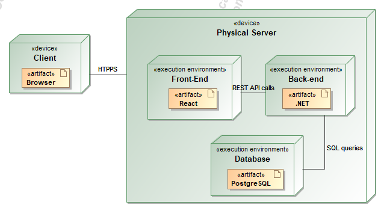

### Wireframes

#### Login page:

Wireframe:

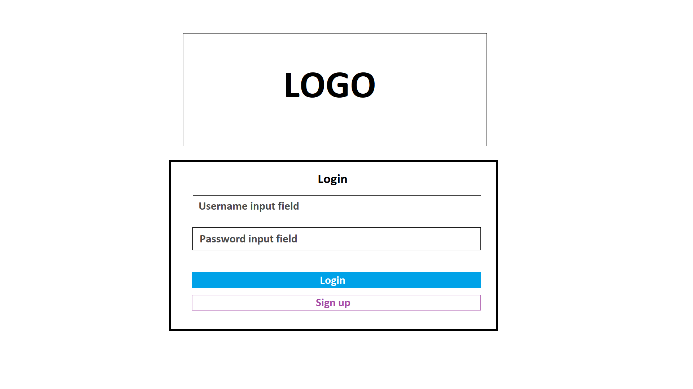

Result:

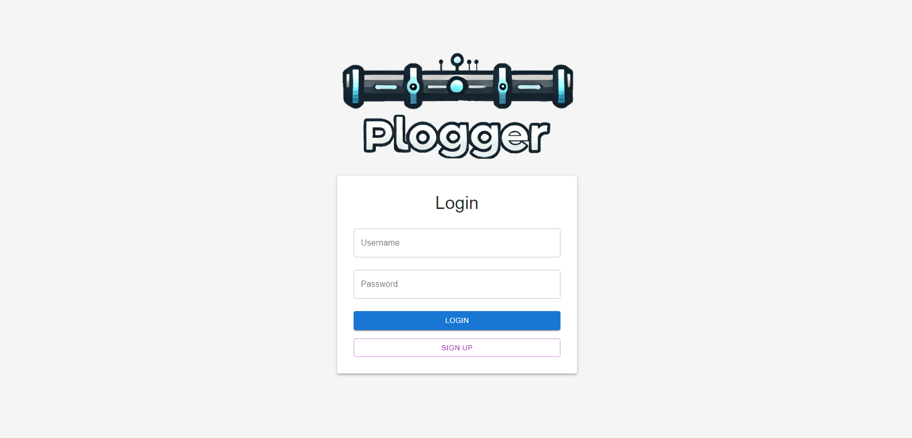

#### Pipelines list page:

Wireframe:

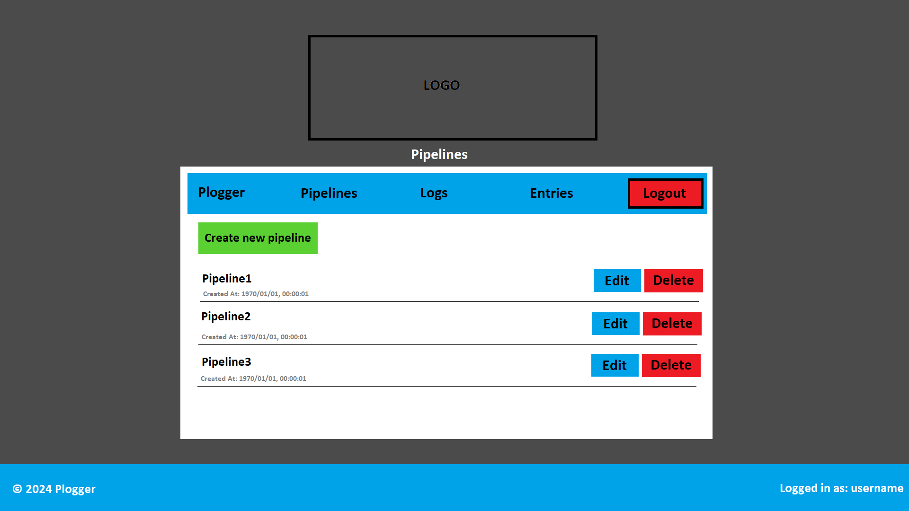

Result:

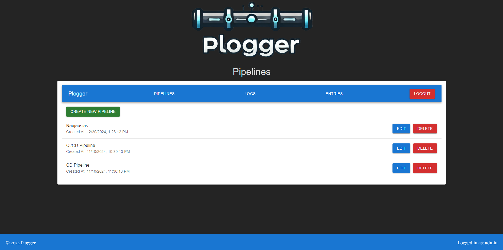

#### Create Pipeline page:

Wireframe:

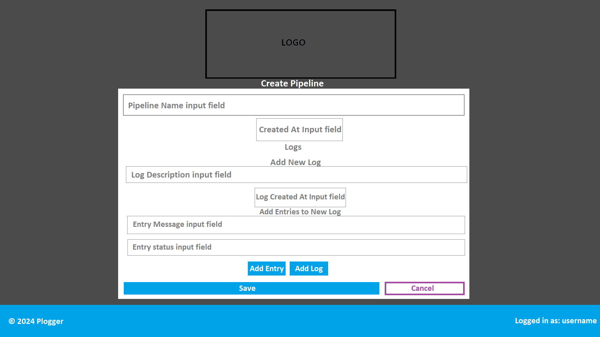

Result:

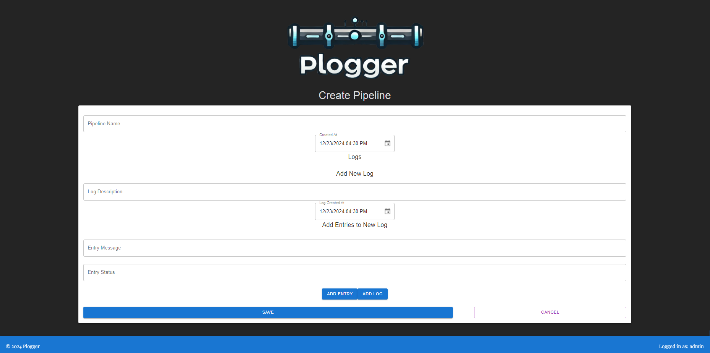

#### Edit Pipeline page:

Wireframe:

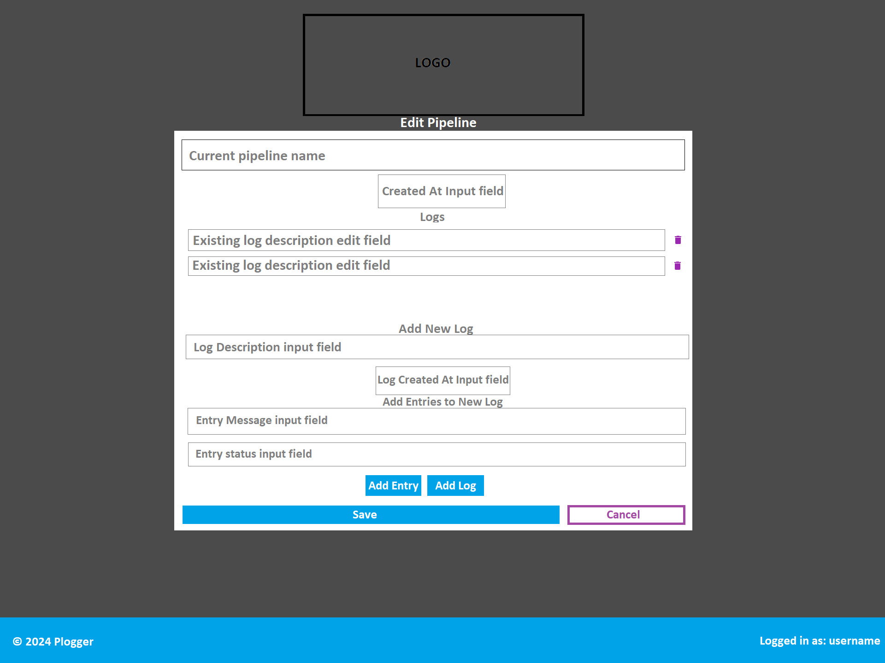

Result:

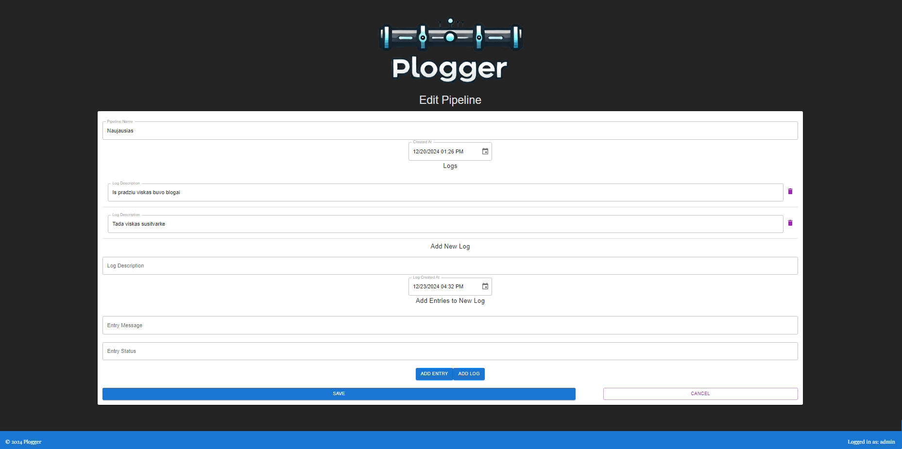

#### Delete Pipeline page:

Wireframe:

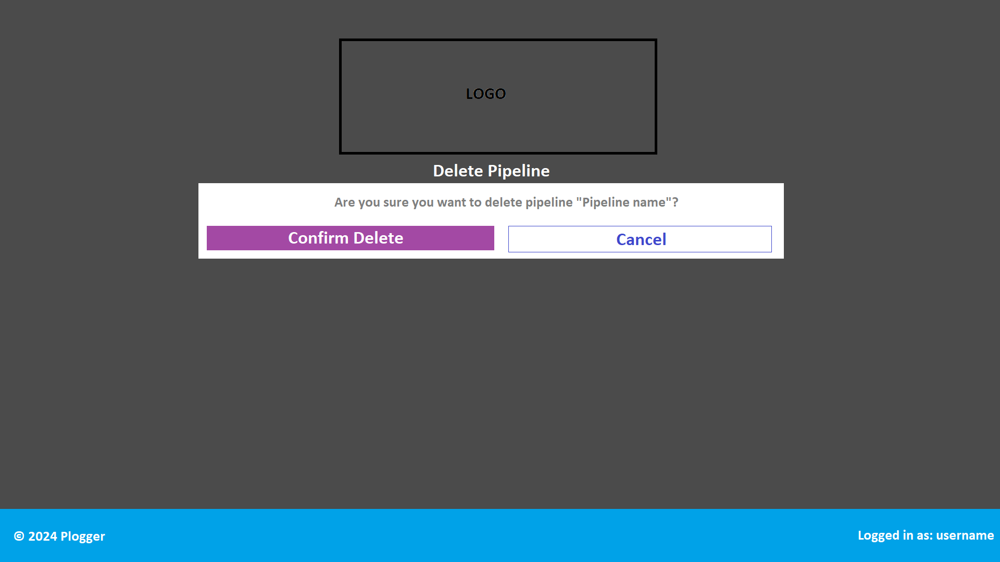

Result:

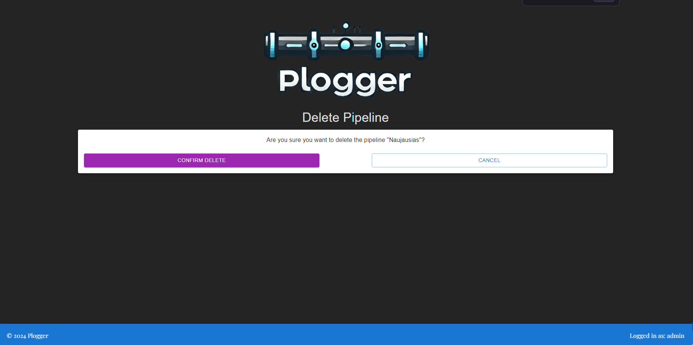


### OpenAPI Documentation

| Method | Path | Description |
| --- | --- | --- |
| GET | [/api/Entries](#getapientries) |  Gets list of entries |
| POST | [/api/Entries](#postapientries) | Creates an entry |
| GET | [/api/Entries/{id}](#getapientriesid) | Gets a single entry |
| PUT | [/api/Entries/{id}](#putapientriesid) | Updates an entry |
| DELETE | [/api/Entries/{id}](#deleteapientriesid) | Deletes an entry |
| GET | [/api/Logs](#getapilogs) | Gets list of logs |
| POST | [/api/Logs](#postapilogs) | Creates a log |
| GET | [/api/Logs/{id}](#getapilogsid) | Gets a single log |
| PUT | [/api/Logs/{id}](#putapilogsid) | Updates a log |
| DELETE | [/api/Logs/{id}](#deleteapilogsid) | Deletes a log |
| GET | [/api/Pipelines](#getapipipelines) | Gets list of pipelines |
| POST | [/api/Pipelines](#postapipipelines) | Creates a pipeline |
| GET | [/api/Pipelines/{id}](#getapipipelinesid) | Gets a single pipeline |
| PUT | [/api/Pipelines/{id}](#putapipipelinesid) | Updates a pipeline |
| DELETE | [/api/Pipelines/{id}](#deleteapipipelinesid) | Deletes a pipeline |
| POST | [/api/accounts](#postapiaccounts) | Creates an user |
| POST | [/api/login](#postapilogin) | Logins the user to the system |
| POST | [/api/accessToken](#postapiaccesstoken) | Gets the access token |
| POST | [/api/logout](#postapilogout) | Logs the user out of the system |


## Path Details


### [GET]/api/Entries

#### Responses

- 200 Success

- 404 Not Found

***

### [POST]/api/Entries

#### RequestBody

- application/json

```ts
{
  id?: string
  logId?: string
  message?: string
  status?: integer
  createdAt?: string
  userId?: string
  user: {
    id?: string
    userName?: string
    normalizedUserName?: string
    email?: string
    normalizedEmail?: string
    emailConfirmed?: boolean
    passwordHash?: string
    securityStamp?: string
    concurrencyStamp?: string
    phoneNumber?: string
    phoneNumberConfirmed?: boolean
    twoFactorEnabled?: boolean
    lockoutEnd?: string
    lockoutEnabled?: boolean
    accessFailedCount?: integer
    company?: string
  }
}
```


#### Responses

- 200 Success

- 400 Bad Request

- 422 Unprocessable Content

***

### [GET]/api/Entries/{id}

#### Responses

- 200 Success

- 404 Not Found

***

### [PUT]/api/Entries/{id}

#### RequestBody

- application/json

```ts
{
  id?: string
  logId?: string
  message?: string
  status?: integer
  createdAt?: string
  userId?: string
  user: {
    id?: string
    userName?: string
    normalizedUserName?: string
    email?: string
    normalizedEmail?: string
    emailConfirmed?: boolean
    passwordHash?: string
    securityStamp?: string
    concurrencyStamp?: string
    phoneNumber?: string
    phoneNumberConfirmed?: boolean
    twoFactorEnabled?: boolean
    lockoutEnd?: string
    lockoutEnabled?: boolean
    accessFailedCount?: integer
    company?: string
  }
}
```


#### Responses

- 200 Success

- 201 Created

- 400 Bad Request

- 404 Not Found

- 422 Unprocessable Content

***

### [DELETE]/api/Entries/{id}

#### Responses

- 204 No Content

- 404 Not Found

***

### [GET]/api/Logs

#### Responses

- 200 Success

***

### [POST]/api/Logs

#### RequestBody

- application/json

```ts
{
  id?: string
  pipelineId?: string
  description?: string
  createdAt?: string
  entries: {
    id?: string
    logId?: string
    message?: string
    status?: integer
    createdAt?: string
    userId?: string
    user: {
      id?: string
      userName?: string
      normalizedUserName?: string
      email?: string
      normalizedEmail?: string
      emailConfirmed?: boolean
      passwordHash?: string
      securityStamp?: string
      concurrencyStamp?: string
      phoneNumber?: string
      phoneNumberConfirmed?: boolean
      twoFactorEnabled?: boolean
      lockoutEnd?: string
      lockoutEnabled?: boolean
      accessFailedCount?: integer
      company?: string
    }
  }[]
  userId?: string
  user:#/components/schemas/LoggerUser
}
```


#### Responses

- 200 Success

- 400 Bad Request

- 422 Unprocessable Content

***

### [GET]/api/Logs/{id}

#### Responses

- 200 Success

- 404 Not Found

***

### [PUT]/api/Logs/{id}

#### RequestBody

- application/json

```ts
{
  id?: string
  pipelineId?: string
  description?: string
  createdAt?: string
  entries: {
    id?: string
    logId?: string
    message?: string
    status?: integer
    createdAt?: string
    userId?: string
    user: {
      id?: string
      userName?: string
      normalizedUserName?: string
      email?: string
      normalizedEmail?: string
      emailConfirmed?: boolean
      passwordHash?: string
      securityStamp?: string
      concurrencyStamp?: string
      phoneNumber?: string
      phoneNumberConfirmed?: boolean
      twoFactorEnabled?: boolean
      lockoutEnd?: string
      lockoutEnabled?: boolean
      accessFailedCount?: integer
      company?: string
    }
  }[]
  userId?: string
  user:#/components/schemas/LoggerUser
}
```

#### Responses

- 200 Success

- 201 Created

- 400 Bad Request

- 404 Not Found

- 422 Unprocessable Content

***

### [DELETE]/api/Logs/{id}

#### Responses

- 204 No Content

- 404 Not Found

***

### [GET]/api/Pipelines

#### Responses

- 200 Success

***

### [POST]/api/Pipelines

#### RequestBody

- application/json

```ts
{
  id?: string
  name?: string
  createdAt?: string
  logs: {
    id?: string
    pipelineId?: string
    description?: string
    createdAt?: string
    entries: {
      id?: string
      logId?: string
      message?: string
      status?: integer
      createdAt?: string
      userId?: string
      user: {
        id?: string
        userName?: string
        normalizedUserName?: string
        email?: string
        normalizedEmail?: string
        emailConfirmed?: boolean
        passwordHash?: string
        securityStamp?: string
        concurrencyStamp?: string
        phoneNumber?: string
        phoneNumberConfirmed?: boolean
        twoFactorEnabled?: boolean
        lockoutEnd?: string
        lockoutEnabled?: boolean
        accessFailedCount?: integer
        company?: string
      }
    }[]
    userId?: string
    user:#/components/schemas/LoggerUser
  }[]
  userId?: string
  user:#/components/schemas/LoggerUser
}
```

#### Responses

- 200 Success

- 400 Bad Request

- 422 Unprocessable Content

***

### [GET]/api/Pipelines/{id}

#### Responses

- 200 Success

- 404 Not Found

***

### [PUT]/api/Pipelines/{id}

#### RequestBody

- application/json

```ts
{
  id?: string
  name?: string
  createdAt?: string
  logs: {
    id?: string
    pipelineId?: string
    description?: string
    createdAt?: string
    entries: {
      id?: string
      logId?: string
      message?: string
      status?: integer
      createdAt?: string
      userId?: string
      user: {
        id?: string
        userName?: string
        normalizedUserName?: string
        email?: string
        normalizedEmail?: string
        emailConfirmed?: boolean
        passwordHash?: string
        securityStamp?: string
        concurrencyStamp?: string
        phoneNumber?: string
        phoneNumberConfirmed?: boolean
        twoFactorEnabled?: boolean
        lockoutEnd?: string
        lockoutEnabled?: boolean
        accessFailedCount?: integer
        company?: string
      }
    }[]
    userId?: string
    user:#/components/schemas/LoggerUser
  }[]
  userId?: string
  user:#/components/schemas/LoggerUser
}
```

#### Responses

- 200 Success

- 201 Created

- 400 Bad Request

- 404 Not Found

- 422 Unprocessable Content

***

### [DELETE]/api/Pipelines/{id}

#### Responses

- 200 Success

- 404 Not Found

***

### [POST]/api/accounts

#### RequestBody

- application/json

```ts
{
  userName?: string
  email?: string
  password?: string
  company?: string
  roles?: string[]
}
```

#### Responses

- 201 Created

- 422 Unprocessable Content

***

### [POST]/api/login

#### RequestBody

- application/json

```ts
{
  userName?: string
  password?: string
}
```

#### Responses

- 200 Success

- 422 Unprocessable Content

***

### [POST]/api/accessToken

#### Responses

- 201 Created

- 422 Unprocessable Content

***

### [POST]/api/logout

#### Responses

- 201 Created

- 422 Unprocessable Content

## References

### #/components/schemas/Entry

```ts
{
  id?: string
  logId?: string
  message?: string
  status?: integer
  createdAt?: string
  userId?: string
  user: {
    id?: string
    userName?: string
    normalizedUserName?: string
    email?: string
    normalizedEmail?: string
    emailConfirmed?: boolean
    passwordHash?: string
    securityStamp?: string
    concurrencyStamp?: string
    phoneNumber?: string
    phoneNumberConfirmed?: boolean
    twoFactorEnabled?: boolean
    lockoutEnd?: string
    lockoutEnabled?: boolean
    accessFailedCount?: integer
    company?: string
  }
}
```

### #/components/schemas/Log

```ts
{
  id?: string
  pipelineId?: string
  description?: string
  createdAt?: string
  entries: {
    id?: string
    logId?: string
    message?: string
    status?: integer
    createdAt?: string
    userId?: string
    user: {
      id?: string
      userName?: string
      normalizedUserName?: string
      email?: string
      normalizedEmail?: string
      emailConfirmed?: boolean
      passwordHash?: string
      securityStamp?: string
      concurrencyStamp?: string
      phoneNumber?: string
      phoneNumberConfirmed?: boolean
      twoFactorEnabled?: boolean
      lockoutEnd?: string
      lockoutEnabled?: boolean
      accessFailedCount?: integer
      company?: string
    }
  }[]
  userId?: string
  user:#/components/schemas/LoggerUser
}
```

### #/components/schemas/LoggerUser

```ts
{
  id?: string
  userName?: string
  normalizedUserName?: string
  email?: string
  normalizedEmail?: string
  emailConfirmed?: boolean
  passwordHash?: string
  securityStamp?: string
  concurrencyStamp?: string
  phoneNumber?: string
  phoneNumberConfirmed?: boolean
  twoFactorEnabled?: boolean
  lockoutEnd?: string
  lockoutEnabled?: boolean
  accessFailedCount?: integer
  company?: string
}
```

### #/components/schemas/LoginDTO

```ts
{
  userName?: string
  password?: string
}
```

### #/components/schemas/Pipeline

```ts
{
  id?: string
  name?: string
  createdAt?: string
  logs: {
    id?: string
    pipelineId?: string
    description?: string
    createdAt?: string
    entries: {
      id?: string
      logId?: string
      message?: string
      status?: integer
      createdAt?: string
      userId?: string
      user: {
        id?: string
        userName?: string
        normalizedUserName?: string
        email?: string
        normalizedEmail?: string
        emailConfirmed?: boolean
        passwordHash?: string
        securityStamp?: string
        concurrencyStamp?: string
        phoneNumber?: string
        phoneNumberConfirmed?: boolean
        twoFactorEnabled?: boolean
        lockoutEnd?: string
        lockoutEnabled?: boolean
        accessFailedCount?: integer
        company?: string
      }
    }[]
    userId?: string
    user:#/components/schemas/LoggerUser
  }[]
  userId?: string
  user:#/components/schemas/LoggerUser
}
```

### #/components/schemas/RegisterUserDTO

```ts
{
  userName?: string
  email?: string
  password?: string
  company?: string
  roles?: string[]
}
```

# Conclusion

The project was a success, pipelines can be stored and viewed at any time. The only downside was the UI interface, because the project started as an api project and the UI part serves little purpose other than viewing the pipeline logs. Next time I would put more thought into planning an app that will have more features and think about a better cloud solution.